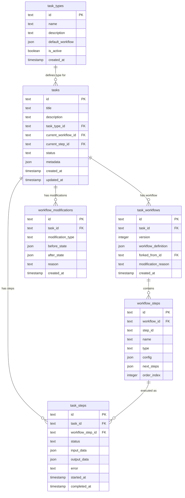

# データベース設計書

## 概要

ワークフロー可視化システムのデータベーススキーマ設計書です。

- **データベース**: SQLite 3.40+
- **ORMライブラリ**: Better-SQLite3
- **マイグレーション**: sql-migrate
- **文字エンコーディング**: UTF-8

## 設計方針

1. **正規化**: 第3正規形を基本とし、パフォーマンスを考慮して適切に非正規化
2. **インデックス**: クエリパフォーマンスを最適化
3. **制約**: データ整合性を保証
4. **JSON活用**: 柔軟なデータ構造にはJSON型を使用
5. **タイムスタンプ**: 全テーブルにcreated_at, updated_atを付与

## ER図



## テーブル定義

### task_types（タスクタイプ定義）

```sql
CREATE TABLE task_types (
    id TEXT PRIMARY KEY DEFAULT (printf('tt_%s', hex(randomblob(8)))),
    name TEXT NOT NULL UNIQUE,
    description TEXT,
    default_workflow JSON NOT NULL,
    is_active BOOLEAN DEFAULT 1,
    created_at TIMESTAMP DEFAULT CURRENT_TIMESTAMP
);

-- 初期データ
INSERT INTO task_types (id, name, description, default_workflow) VALUES
('tt_feature', 'feature-planning', '新機能の企画・提案', '{"steps": [{"id": "research", "name": "リサーチ"}, {"id": "ideation", "name": "アイデア整理"}, {"id": "proposal", "name": "提案書作成"}, {"id": "issue", "name": "Issue作成"}]}'),
('tt_issue', 'issue-resolution', 'Issueの解決', '{"steps": [{"id": "analysis", "name": "分析"}, {"id": "design", "name": "設計"}, {"id": "implementation", "name": "実装"}, {"id": "testing", "name": "テスト"}, {"id": "pr", "name": "PR作成"}, {"id": "review", "name": "レビュー"}]}'),
('tt_docs', 'documentation', 'ドキュメント更新', '{"steps": [{"id": "research", "name": "調査"}, {"id": "writing", "name": "執筆"}, {"id": "review", "name": "レビュー"}, {"id": "publish", "name": "公開"}]}'),
('tt_research', 'research', '調査・研究', '{"steps": [{"id": "gather", "name": "情報収集"}, {"id": "analyze", "name": "分析"}, {"id": "report", "name": "レポート作成"}]}'),
('tt_refactor', 'refactoring', 'リファクタリング', '{"steps": [{"id": "analysis", "name": "現状分析"}, {"id": "design", "name": "設計"}, {"id": "implementation", "name": "実装"}, {"id": "testing", "name": "テスト"}, {"id": "measurement", "name": "性能測定"}]}'),
('tt_custom', 'custom', 'カスタムタスク', '{"steps": []}');
```

### tasks（タスク）

```sql
CREATE TABLE tasks (
    id TEXT PRIMARY KEY DEFAULT (printf('task_%s', hex(randomblob(8)))),
    title TEXT NOT NULL,
    description TEXT,
    task_type_id TEXT NOT NULL,
    current_workflow_id TEXT,
    current_step_id TEXT,
    status TEXT DEFAULT 'pending' CHECK(status IN ('pending', 'active', 'completed', 'failed', 'cancelled')),
    metadata JSON,
    created_at TIMESTAMP DEFAULT CURRENT_TIMESTAMP,
    updated_at TIMESTAMP DEFAULT CURRENT_TIMESTAMP,
    FOREIGN KEY (task_type_id) REFERENCES task_types(id),
    FOREIGN KEY (current_workflow_id) REFERENCES task_workflows(id)
);

-- インデックス
CREATE INDEX idx_tasks_status ON tasks(status);
CREATE INDEX idx_tasks_task_type ON tasks(task_type_id);
CREATE INDEX idx_tasks_created_at ON tasks(created_at);
```

### task_workflows（タスクワークフロー）

```sql
CREATE TABLE task_workflows (
    id TEXT PRIMARY KEY DEFAULT (printf('tw_%s', hex(randomblob(8)))),
    task_id TEXT NOT NULL,
    version INTEGER NOT NULL DEFAULT 1,
    workflow_definition JSON NOT NULL,
    forked_from_id TEXT,
    modification_reason TEXT,
    created_at TIMESTAMP DEFAULT CURRENT_TIMESTAMP,
    FOREIGN KEY (task_id) REFERENCES tasks(id) ON DELETE CASCADE,
    FOREIGN KEY (forked_from_id) REFERENCES task_workflows(id),
    UNIQUE(task_id, version)
);

-- インデックス
CREATE INDEX idx_task_workflows_task_id ON task_workflows(task_id);
```

### workflow_steps（ワークフローステップ定義）

```sql
CREATE TABLE workflow_steps (
    id TEXT PRIMARY KEY DEFAULT (printf('ws_%s', hex(randomblob(8)))),
    workflow_id TEXT NOT NULL,
    step_id TEXT NOT NULL,
    name TEXT NOT NULL,
    type TEXT DEFAULT 'task',
    config JSON,
    next_steps JSON, -- ["step_id1", "step_id2"] or [{"id": "step_id", "condition": {...}}]
    order_index INTEGER,
    created_at TIMESTAMP DEFAULT CURRENT_TIMESTAMP,
    FOREIGN KEY (workflow_id) REFERENCES task_workflows(id) ON DELETE CASCADE,
    UNIQUE(workflow_id, step_id)
);

-- インデックス
CREATE INDEX idx_workflow_steps_workflow_id ON workflow_steps(workflow_id);
CREATE INDEX idx_workflow_steps_order ON workflow_steps(order_index);
```

### task_steps（タスクステップ実行記録）

```sql
CREATE TABLE task_steps (
    id TEXT PRIMARY KEY DEFAULT (printf('ts_%s', hex(randomblob(8)))),
    task_id TEXT NOT NULL,
    workflow_step_id TEXT NOT NULL,
    status TEXT NOT NULL DEFAULT 'pending' CHECK(status IN ('pending', 'running', 'completed', 'failed', 'skipped')),
    input_data JSON,
    output_data JSON,
    error TEXT,
    started_at TIMESTAMP,
    completed_at TIMESTAMP,
    created_at TIMESTAMP DEFAULT CURRENT_TIMESTAMP,
    FOREIGN KEY (task_id) REFERENCES tasks(id) ON DELETE CASCADE,
    FOREIGN KEY (workflow_step_id) REFERENCES workflow_steps(id)
);

-- インデックス
CREATE INDEX idx_task_steps_task_id ON task_steps(task_id);
CREATE INDEX idx_task_steps_status ON task_steps(status);
```

### workflow_modifications（ワークフロー変更履歴）

```sql
CREATE TABLE workflow_modifications (
    id TEXT PRIMARY KEY DEFAULT (printf('wm_%s', hex(randomblob(8)))),
    task_id TEXT NOT NULL,
    modification_type TEXT NOT NULL CHECK(modification_type IN ('add_step', 'remove_step', 'modify_step', 'reorder', 'fork')),
    before_state JSON,
    after_state JSON,
    reason TEXT,
    created_at TIMESTAMP DEFAULT CURRENT_TIMESTAMP,
    FOREIGN KEY (task_id) REFERENCES tasks(id) ON DELETE CASCADE
);

-- インデックス
CREATE INDEX idx_workflow_modifications_task_id ON workflow_modifications(task_id);
CREATE INDEX idx_workflow_modifications_created_at ON workflow_modifications(created_at);
```

## ビュー定義

### execution_summary（実行サマリービュー）

```sql
CREATE VIEW execution_summary AS
SELECT
    e.id,
    e.workflow_id,
    w.name as workflow_name,
    e.status,
    e.triggered_by,
    u.name as triggered_by_name,
    e.started_at,
    e.completed_at,
    e.duration,
    COUNT(DISTINCT es.id) as total_steps,
    COUNT(DISTINCT CASE WHEN es.status = 'completed' THEN es.id END) as completed_steps,
    COUNT(DISTINCT CASE WHEN es.status = 'failed' THEN es.id END) as failed_steps
FROM executions e
LEFT JOIN workflows w ON e.workflow_id = w.id
LEFT JOIN users u ON e.triggered_by = u.id
LEFT JOIN execution_steps es ON e.id = es.execution_id
GROUP BY e.id;
```

### workflow_statistics（ワークフロー統計ビュー）

```sql
CREATE VIEW workflow_statistics AS
SELECT
    w.id,
    w.name,
    COUNT(DISTINCT e.id) as total_executions,
    COUNT(DISTINCT CASE WHEN e.status = 'completed' THEN e.id END) as successful_executions,
    COUNT(DISTINCT CASE WHEN e.status = 'failed' THEN e.id END) as failed_executions,
    AVG(e.duration) as avg_duration,
    MAX(e.started_at) as last_executed_at
FROM workflows w
LEFT JOIN executions e ON w.id = e.workflow_id
GROUP BY w.id;
```

## マイグレーション

### 初期マイグレーション（001_initial_schema.sql）

```sql
-- Up
CREATE TABLE workflows (...);
CREATE TABLE workflow_nodes (...);
-- 他のテーブル作成

-- Down
DROP TABLE IF EXISTS execution_logs;
DROP TABLE IF EXISTS execution_steps;
DROP TABLE IF EXISTS executions;
-- 他のテーブル削除
```

### インデックス追加（002_add_indexes.sql）

```sql
-- Up
CREATE INDEX idx_executions_status_started_at ON executions(status, started_at);
CREATE INDEX idx_execution_steps_execution_status ON execution_steps(execution_id, status);

-- Down
DROP INDEX IF EXISTS idx_executions_status_started_at;
DROP INDEX IF EXISTS idx_execution_steps_execution_status;
```

## パフォーマンス最適化

### 推奨設定

```sql
-- SQLite最適化設定
PRAGMA journal_mode = WAL;          -- Write-Ahead Logging
PRAGMA synchronous = NORMAL;        -- パフォーマンスと安全性のバランス
PRAGMA cache_size = -64000;         -- 64MBのキャッシュ
PRAGMA temp_store = MEMORY;         -- 一時データをメモリに保存
PRAGMA mmap_size = 268435456;      -- 256MBのメモリマップI/O
```

### クエリ最適化例

```sql
-- 実行中のワークフロー一覧（最適化済み）
SELECT
    e.id,
    e.workflow_id,
    w.name,
    e.status,
    e.started_at,
    json_extract(e.context, '$.priority') as priority
FROM executions e
INNER JOIN workflows w ON e.workflow_id = w.id
WHERE e.status = 'running'
    AND e.started_at > datetime('now', '-1 day')
ORDER BY priority DESC, e.started_at DESC
LIMIT 50;
```

## バックアップとリカバリ

### バックアップスクリプト

```bash
#!/bin/bash
# backup.sh

DB_PATH="/var/lib/workflow/workflow.db"
BACKUP_DIR="/var/backups/workflow"
TIMESTAMP=$(date +%Y%m%d_%H%M%S)
BACKUP_FILE="${BACKUP_DIR}/workflow_${TIMESTAMP}.db"

# バックアップディレクトリ作成
mkdir -p $BACKUP_DIR

# オンラインバックアップ
sqlite3 $DB_PATH ".backup $BACKUP_FILE"

# 圧縮
gzip $BACKUP_FILE

# 古いバックアップを削除（30日以上）
find $BACKUP_DIR -name "*.gz" -mtime +30 -delete
```

### リストアスクリプト

```bash
#!/bin/bash
# restore.sh

BACKUP_FILE=$1
DB_PATH="/var/lib/workflow/workflow.db"

if [ -z "$BACKUP_FILE" ]; then
    echo "Usage: $0 <backup_file>"
    exit 1
fi

# 既存DBのバックアップ
cp $DB_PATH "${DB_PATH}.before_restore"

# 解凍とリストア
gunzip -c $BACKUP_FILE > /tmp/restore.db
mv /tmp/restore.db $DB_PATH

echo "Database restored from $BACKUP_FILE"
```
